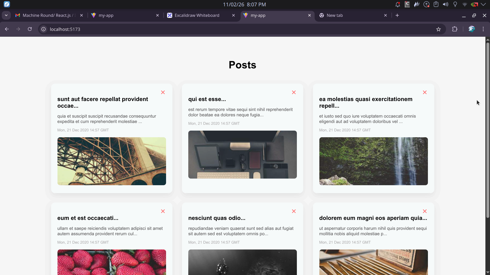

# Posts Dashboard

A React application that displays a list of posts with pagination and delete functionality and uses redux for global state management.

---

## Features

- Fetch posts from external API
- 6 cards displayed per page
- Pagination with page navigation
- Delete a card dynamically
- Automatically maintains 6 visible cards after deletion
- 5-second loading state on initial load

---

## 🛠 Tech Stack

- React
- Redux Toolkit

---

## Run Locally

Clone the repository:

```bash
git clone https://github.com/Nitin-Shivhare/posts-dashboard.git
cd posts-dashboard
npm install
npm run dev
```

---

## Preview


